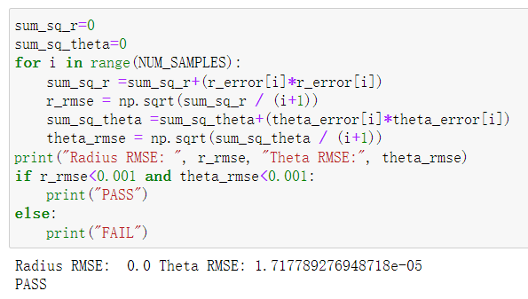

# AMD-Xilinx_SummerSchool2022_Cordiccart2pol
This repository is AMD-Xilinx Summer School 2022's homework project.

## Environment
Vitis HLS 2021.2、Vivado 2021.2
## jupyter
This folder includes the jupyter file to be uploaded to the board which has PYNQ architecture
## overlay
This folder includes the bitstream(.bit) and hardware handoff(.hwh) file to be uploaded to the board which has PYNQ architecture
## pictures
This folder includes the jupyter's result pictures
## report
This folder includes the Vitis HLS's C Synthesis report and C/RTL Cosimulation report
## src
This folder includes the source code for Vitis HLS

## Results between python's coodinate transformation and customized IP
### Error print

### RMSE

### Error histogram
